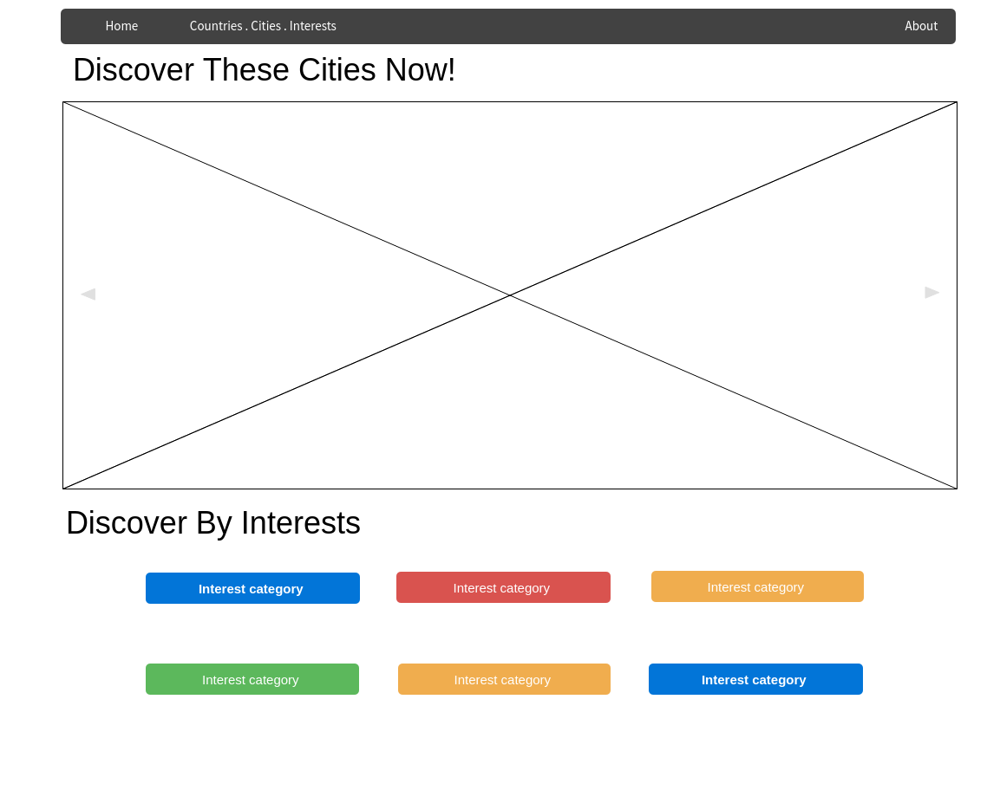
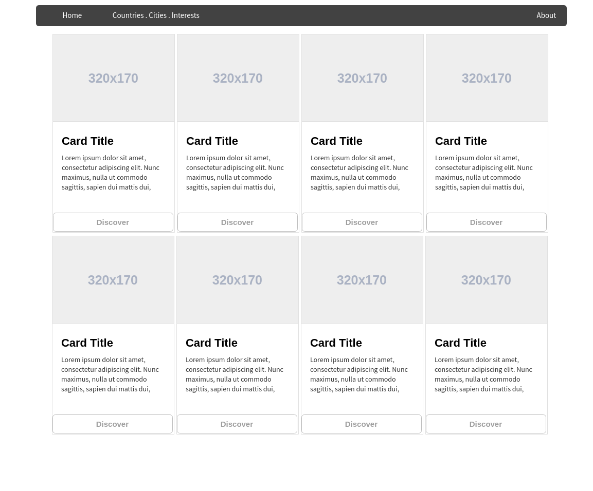
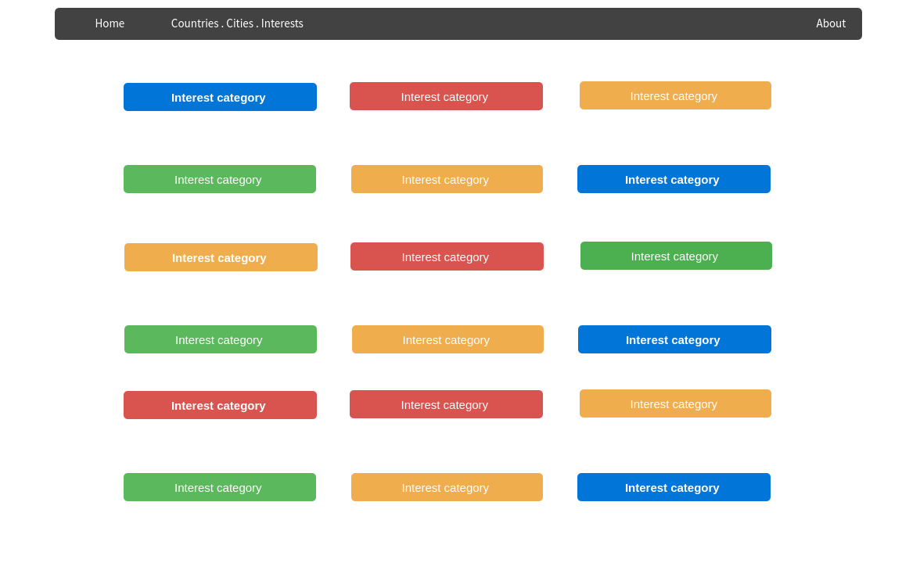
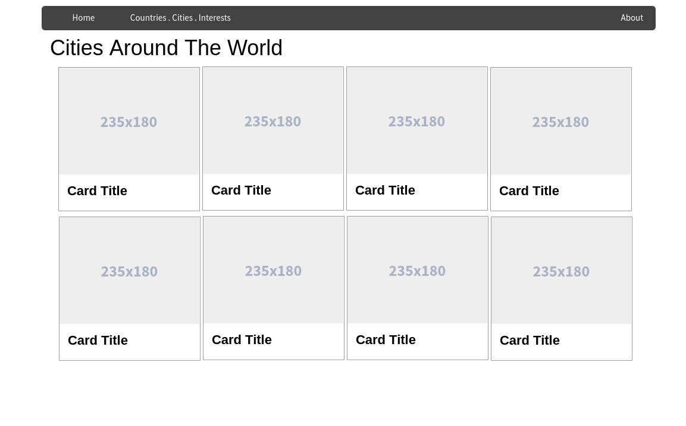
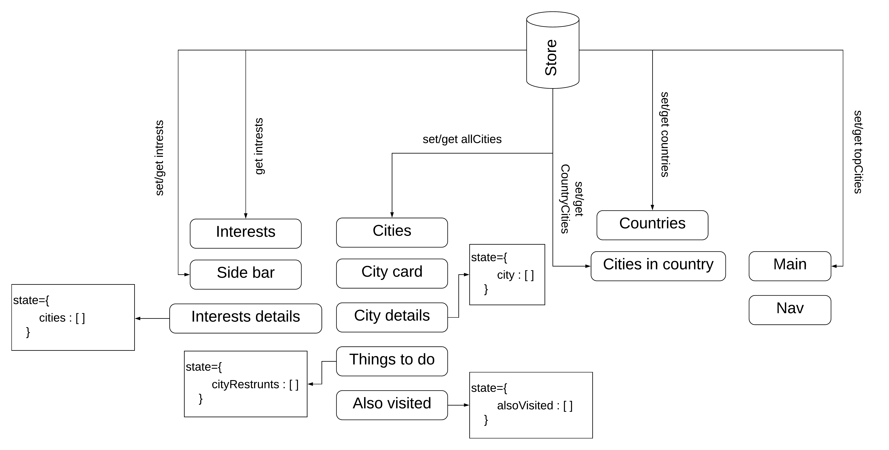

# Triple Web App
This is a travel advisor web app were user can plan a trip by discovering countries and cities around the world , also user can discover cities by interests.

# Wireframe
### Home Page

### Countries Page

### Interests Page

### Cities Page

### City Details Page

# State Management

# User Stories
 1. User can press on any top city and go to the city details page.
 2. User can press on any interests and go to the list of cities containing this interest.
 3. User can discover all countries when press on countries tab on the nav bar.
 4. User can enter any country and discover its cities.
 5. User can discover all interests when press on interests tab on the nav bar.
 6. User can discover all cities when press on cities tab on the nav bar.
 7. User can see restaurants in a city in the city details page and also cities visited by others.

# Challenges
 -  Working with the API and getting the requested data for the app.
 -  Working with bootstrap in react.

# Technologies Used 
 - React
 - Triposo API
 - JavaScript
 - Redux in react
 - Bootstrap in react
 - Axios in react
 - CSS

# Features and improvements
- Fix the search bar.
- User account.
- Add rating for visitor to rate the cities.
- Provide trip planning feature.
- Map for places and resturants.
- Add favorite cities list.

# Links
- [Triposo](https://www.triposo.com/api/documentation/20190906/examples)
- [React Bootstrap](https://react-bootstrap.github.io/)
- [React Redux](https://react-redux.js.org/)